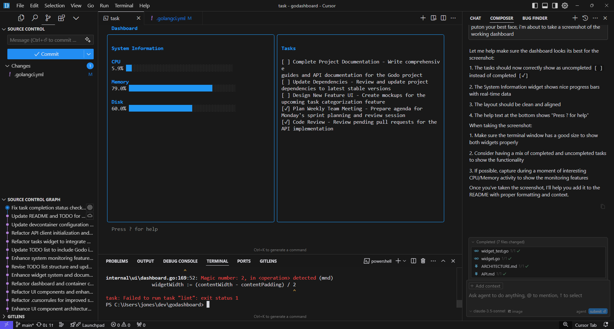

# Go Dashboard

A terminal-based system dashboard built with Go, featuring real-time system monitoring, todo management, and process monitoring.



## Features

- Real-time system monitoring
  - CPU usage with visual progress bars
  - Memory usage tracking
  - Disk space monitoring
- Advanced widget system
  - Grid-based layout with dynamic sizing
  - Flexible widget positioning
  - Automatic size constraints
  - Focus management with keyboard navigation
- Modern terminal UI
  - Smooth updates and resizing
  - Keyboard navigation with help system
  - Color themes with focus indicators
  - Responsive layout handling
- Performance optimized
  - Style and content caching
  - Minimal memory allocations
  - Efficient widget updates
  - Smart resize handling
- Structured logging
  - Zap-based logging with rotation
  - Debug output support
  - Comprehensive test logging
  - Request tracking
- Task Management
  - Integration with Godo API
  - Create, read, update, delete tasks
  - Task completion tracking
  - Loading and error states

## Prerequisites

- Go 1.23 or later
- Task (task-based build tool)
- Git

## Installation

1. Clone the repository:
```bash
git clone https://github.com/jonesrussell/dashboard.git
cd dashboard
```

2. Install dependencies:
```bash
task deps
```

3. Build the project:
```bash
task build
```

## Usage

Run the dashboard:
```bash
# Configure API endpoint (optional)
export GODO_API_URL="http://localhost:8080"  # Default: http://host.docker.internal:8080 (when running in Docker)

# Run dashboard
task run
```

Run with debug output:
```bash
task run-debug
```

Run in external window:
```bash
task run-external
```

### Keyboard Controls

- `Tab` - Navigate between widgets
- `Enter` - Select/activate widget
- `Space` - Toggle task completion
- `n` - Create new task
- `d` - Delete selected task
- `q` or `Ctrl+C` - Quit
- `?` - Toggle help

## Documentation

- [Architecture Overview](docs/ARCHITECTURE.md)
- [API Documentation](docs/API.md)
- [Development Guide](docs/DEVELOPMENT.md)

## Development

### Requirements

- Go 1.23+
- Task
- Wire (dependency injection)
- golangci-lint

### Setup Development Environment

1. Install development tools:
```bash
task install-tools
```

2. Run tests:
```bash
task test
```

3. Run linter:
```bash
task lint
```

4. Run benchmarks:
```bash
task bench
```

### Project Structure

```
.
├── cmd/
│   └── dashboard/     # Main application
├── docs/             # Documentation
│   ├── ARCHITECTURE.md
│   ├── API.md
│   └── DEVELOPMENT.md
├── internal/
│   ├── logger/        # Logging package
│   ├── testutil/      # Test utilities
│   └── ui/           # User interface
│       ├── components/  # UI components
│       ├── container/   # Widget container
│       ├── styles/      # UI styling
│       └── widgets/     # Dashboard widgets
├── pkg/              # Public packages
└── test/            # Test utilities
```

## Contributing

1. Fork the repository
2. Create your feature branch
3. Commit your changes
4. Push to the branch
5. Create a Pull Request

### Code Style

- Follow Go conventions
- Use provided test utilities
- Add tests for new features
- Document exported symbols
- Run linter before committing

## License

This project is licensed under the MIT License - see the LICENSE file for details.

